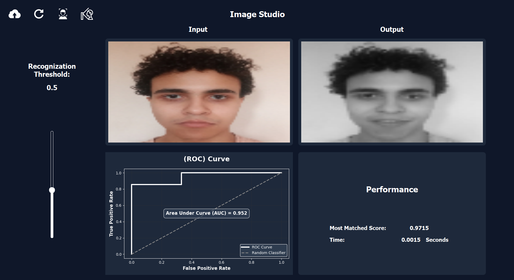

# IdentiFace: Face Recognition & Detection 

IdentiFace is a Python desktop application built with PyQt5 for face detection and recognition. The app leverages Principal Component Analysis (PCA)/Eigenfaces for robust face recognition and provides performance reporting with ROC curve visualization.

## Features

- **Dataset Support**: Compatible with standard face datasets ([face-rec.org/databases](http://www.face-rec.org/databases/))
- **Face Detection**: Detects faces in both color and grayscale images
- **Face Recognition**: Uses PCA/Eigenfaces for accurate face identification
- **Performance Reporting**: Generates reports and plots ROC curves for evaluation

### Prerequisites

- Python 3.7+
- [PyQt5](https://pypi.org/project/PyQt5/)
- [NumPy](https://pypi.org/project/numpy/)
- [OpenCV](https://pypi.org/project/opencv-python/)
- [scikit-learn](https://pypi.org/project/scikit-learn/)
- [matplotlib](https://pypi.org/project/matplotlib/)

Install dependencies:

```bash
pip install PyQt5 numpy opencv-python scikit-learn matplotlib
```

## Usage

1. **Prepare Dataset**  
   Download and extract a dataset from [face-rec.org/databases](http://www.face-rec.org/databases/)  
   Place the dataset in the appropriate folder (see application instructions).

2. **Run the Application**

   ```bash
   python main.py
   ```

3. **Face Detection**  
   - Load images (color or grayscale)
   - Detect faces using the GUI

4. **Face Recognition**  
   - Train the recognizer on your dataset
   - Recognize faces using PCA/Eigenfaces

5. **Performance Evaluation**  
   - View detailed performance metrics
   - Plot and analyze the ROC curve

## Screenshots



## How It Works

- **Detection**: Uses OpenCV Haar cascades or DNN models to locate faces.
- **Recognition**: Implements PCA (Eigenfaces) to extract facial features and perform classification.
- **Reporting**: Calculates true/false positive/negative rates and visualizes ROC curve using matplotlib.

## Contributors <a name = "Contributors"></a>
<table>
  <tr>
     <td align="center">
    <a href="https://github.com/karreemm" target="_black">
    
    <br />
    <sub><b>Kareem Abdel nabi</b></sub></a>
    </td>
    <td align="center">
    <a href="https://github.com/Youssef-Abo-El-Ela" target="_black">
    
    <br />
    <sub><b>Youssef Aboelela</b></sub></a>
    </td>
    <td align="center">
    <a href="https://github.com/aliyounis33" target="_black">
    
    <br />
    <sub><b>Ali Younis</b></sub></a>
    </td>
    <td align="center">
    <a href="https://github.com/louai111" target="_black">
    
    <br />
    <sub><b>Louai Khaled</b></sub></a>
    </td>
      </tr>
</table>
